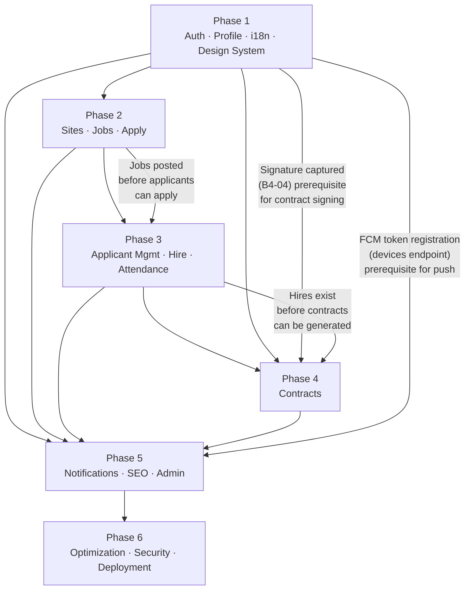

# Implementation Plan — GADA VN

**Last updated**: 2026-03-21
**Stack**: Next.js 15.2 (web) · Laravel 11 (API + admin) · Expo SDK 51 (mobile) · PostgreSQL 16 + PostGIS
**Monorepo**: pnpm + Turborepo at `/Users/leewonyuep/gada-vn/`

---

## Overview Table

| Phase | Title | Scope | Primary Deliverables | Key Dependencies |
|---|---|---|---|---|
| 1 | Auth, Roles, Profile, i18n, Design System | User identity, onboarding, worker/manager profile setup, shared component library | Firebase OTP + Facebook login, worker profile, manager registration, `@gada/ui` foundation | Firebase project setup, S3 bucket configured |
| 2 | Sites, Jobs, Apply | Construction site and job posting management, public SEO job pages, worker apply flow | Public job listing (ISR), job detail (SSR), province GEO pages, manager site/job CRUD | Phase 1 auth complete; `ref.provinces` and `ref.construction_trades` seeded |
| 3 | Applicant Management, Hire, Attendance | Manager accept/reject applicants, hire tracking, daily attendance recording | Applicant list + accept/reject, hire list, attendance grid, work hours tracking | Phase 2 jobs and applications exist; `app.hires` and `app.attendance_records` tables |
| 4 | Contracts | Automated PDF contract generation, worker digital signing | Contract generation queue job (stub→PDF), presigned PDF viewer, worker signature sign flow | Phase 3 hires; Phase 1 signature captured (`app.worker_profiles.signature_s3_key`) |
| 5 | Notifications, SEO, Admin Dashboard | FCM push notifications, full landing page, admin Blade panel, sitemap | Push notifications, landing page, admin approval/user/site/job panels, dynamic sitemap | Phase 1 FCM token registration; all prior phases for admin to show real data |
| 6 | Optimization, Security, QA, Deployment | Production hardening, CI/CD, load tests, security audit, production launch | Lighthouse CI, k6 load tests, security-checklist.md CRITICAL items, Terraform prod deploy, CloudWatch alarms | All Phase 1–5 features stable |

---

## Phase 1 — Auth, Roles, Profile, i18n, Design System

**Goal:** A user can register via phone OTP or Facebook, complete their worker profile including ID document upload and signature, submit a manager registration request, and the admin can approve or reject that request — all with Korean/Vietnamese/English UI fully wired.

---

### Screens (from screen-map.md)

| Screen ID | Screen Name | File Path in `apps/web-next/src/app/[locale]/` |
|---|---|---|
| A-03 | Login — Select method (Phone OTP tab, Password tab, Facebook button) | `(public)/login/page.tsx` |
| A-04 | Login — Phone number entry (step within login page) | `(public)/login/page.tsx` (step 1 of OTP flow) |
| A-05 | Login — OTP verification (6-digit input, resend timer) | `(public)/login/page.tsx` (step 2 of OTP flow) |
| A-06 | Login — Email + password | `(public)/login/page.tsx` (password tab) |
| A-07 | Register — Name + Email + Password | `(public)/register/page.tsx` |
| A-08 | Register — Success | `(public)/register/page.tsx` (success state) |
| A-09 | Forgot password | `(public)/login/page.tsx` (forgot password link) |
| B4-01 | Worker Profile (view + edit) | `(app)/worker/profile/page.tsx` |
| B4-02 | Edit Basic Info | `(app)/worker/profile/page.tsx` (edit mode) |
| B4-03 | ID Document Upload | `(app)/worker/profile/id-upload/page.tsx` |
| B4-04 | Signature Pad | `(app)/worker/profile/signature/page.tsx` |
| B4-05 | Experience List | `(app)/worker/profile/experience/page.tsx` |
| B4-06 | Add / Edit Experience | `(app)/worker/profile/experience/page.tsx` (modal/inline form) |
| B4-07 | Become a Manager — Entry + Status | `(app)/worker/profile/page.tsx` (CTA section) |
| B5-01 | Business Registration form | `(app)/manager/profile/page.tsx` |
| B5-02 | Business doc upload | `(app)/manager/profile/page.tsx` (file upload step) |
| B5-03 | Registration submitted (pending state) | `(app)/manager/profile/page.tsx` (pending status view) |
| B5-04 | Registration rejected + re-submit | `(app)/manager/profile/page.tsx` (rejected status view) |
| F-01 | Admin Login | `apps/admin-laravel/resources/views/admin/layouts/auth.blade.php` |
| F-03 | Manager Approval Queue | `apps/admin-laravel/resources/views/admin/approvals/index.blade.php` |
| F-04 | Manager Approval Detail + approve/reject | `apps/admin-laravel/resources/views/admin/approvals/show.blade.php` |

---

### API Endpoints (from api-summary.md)

**Auth (public)**
- `POST /auth/otp/send` — throttle:5/phone/15min; triggers Firebase Admin SMS
- `POST /auth/otp/verify` — verifies OTP, returns Firebase custom token + `isNewUser` flag
- `POST /auth/register` — completes registration after first OTP verify (name, email, password)
- `POST /auth/login` — email + password login
- `POST /auth/social/facebook` — Firebase ID token → upsert user
- `POST /auth/logout` — revoke Firebase refresh token on all devices

**Account**
- `GET /me` — current user with roles and manager registration status
- `PATCH /me/locale` — set preferred language: `ko` | `vi` | `en`

**Worker Profile**
- `GET /worker/profile` — full profile with ID doc status and signature flag
- `PUT /worker/profile` — update name, DOB, nationality, provinces, trade
- `POST /worker/profile/id-documents` — multipart upload, max 10 MB/file, JPEG/PNG
- `POST /worker/profile/signature` — PNG upload max 2 MB; archives previous
- `GET /worker/experiences` — list own work experience entries
- `POST /worker/experiences` — add experience entry
- `PUT /worker/experiences/{id}` — update own experience entry
- `DELETE /worker/experiences/{id}` — delete own experience entry

**Manager Registration**
- `POST /manager/register` — multipart: business name, reg number, rep name, doc upload (PDF/JPEG/PNG, max 10 MB)
- `GET /manager/registration/status` — current status + rejection reason

**Admin**
- `GET /admin/manager-approvals` — approval queue filtered by `pending|approved|rejected`
- `GET /admin/manager-approvals/{id}` — approval detail with presigned document URL
- `PATCH /admin/manager-approvals/{id}/approve` — grants manager role + sends FCM
- `PATCH /admin/manager-approvals/{id}/reject` — rejection reason required + sends FCM

---

### Laravel Files to Create/Modify

**Controllers (`app/Http/Controllers/Api/`)**
- `Auth/OtpController.php` — `send()`, `verify()`
- `Auth/RegisterController.php` — `store()`
- `Auth/LoginController.php` — `store()`
- `Auth/LogoutController.php` — `destroy()`
- `Auth/FacebookAuthController.php` — `store()`
- `Account/MeController.php` — `show()`, `updateLocale()`
- `Worker/WorkerProfileController.php` — `show()`, `update()`
- `Worker/WorkerIdDocumentController.php` — `store()`
- `Worker/WorkerSignatureController.php` — `store()`
- `Worker/WorkerExperienceController.php` — `index()`, `store()`, `update()`, `destroy()`
- `Manager/ManagerRegistrationController.php` — `store()`, `status()`
- `Admin/AdminApprovalController.php` — `index()`, `show()`, `approve()`, `reject()`

**Admin Blade Controllers (`app/Http/Controllers/Admin/`)**
- `AuthController.php` — `showLogin()`, `login()`, `logout()`
- `ManagerApprovalController.php` — `index()`, `show()`, `approve()`, `reject()`

**Requests (`app/Http/Requests/`)**
- `Auth/SendOtpRequest.php` — validates `phone` (E.164 format, +84/+82 prefix)
- `Auth/VerifyOtpRequest.php` — validates `phone`, `code` (6 digits)
- `Auth/RegisterRequest.php` — validates `name`, `email`, `password` (min 8)
- `Auth/LoginRequest.php` — validates `email`, `password`
- `Auth/FacebookAuthRequest.php` — validates `idToken`
- `Worker/UpdateWorkerProfileRequest.php` — validates name, DOB, nationality, province_ids, trade_id
- `Worker/UploadIdDocumentRequest.php` — validates `front` and `back` files, max 10240 KB, JPEG/PNG
- `Worker/UploadSignatureRequest.php` — validates `signature` PNG, max 2048 KB
- `Worker/StoreExperienceRequest.php` — validates company_name, role, start_date, end_date
- `Manager/ManagerRegisterRequest.php` — validates business_name, registration_number, representative_name, document file
- `Admin/ApproveManagerRequest.php` — (no body required)
- `Admin/RejectManagerRequest.php` — validates `reason` (required, min 10 chars)

**Services (`app/Services/`)**
- `Auth/OtpService.php` — Firebase Admin SMS OTP trigger + verification
- `Auth/FirebaseTokenService.php` — `verifyIdToken()`, `createCustomToken()`
- `Auth/UserSessionService.php` — register, login, logout, social upsert
- `Worker/WorkerProfileService.php` — profile read/write
- `Worker/IdDocumentService.php` — S3 upload + presigned URL generation
- `Worker/SignatureService.php` — S3 upload, archive previous signature key
- `Manager/ManagerRegistrationService.php` — submission, re-submission (archives old row), status check
- `Storage/S3Service.php` — `upload()`, `presignedUrl(ttl=900)`
- `Admin/AdminApprovalService.php` — `approve()`, `reject()` — grants/revokes role, fires FCM

**Models (`app/Models/`)**
- `User.php` (`auth.users`) — `hasRole()`, `isManager()`, `isAdmin()`, relationships to `UserRole`, `WorkerProfile`, `ManagerProfile`
- `UserRole.php` (`auth.user_roles`)
- `WorkerProfile.php` (`app.worker_profiles`) — `hasSignature()` helper
- `IdDocument.php` (`app.id_documents`)
- `WorkExperience.php` (`app.work_experiences`)
- `ManagerProfile.php` (`app.manager_profiles`)
- `AdminApproval.php` (`ops.admin_approvals`)

**Policies (`app/Policies/`)**
- No new Gate policies in Phase 1 beyond role-based middleware; scoping enforced in services.

**Middleware (`app/Http/Middleware/`)**
- `FirebaseAuthMiddleware.php` — verify Bearer token, upsert user, set `app.current_user_id`
- `RoleMiddleware.php` — `role:manager`, `role:admin` checks
- `AdminSessionMiddleware.php` — session auth guard for `/admin/*` routes
- `SetLocaleMiddleware.php` — resolve from `?locale=`, user preference, `Accept-Language`, default `ko`

**Routes (`routes/`)**
- `api.php` — add auth group, account group, worker profile group, manager register group, admin approvals group
- `web.php` — add admin auth routes, admin approvals CRUD routes

**Blade Views (`resources/views/admin/`)**
- `layouts/auth.blade.php` — admin login page layout
- `layouts/app.blade.php` — admin shell (sidebar + topbar + content slot)
- `approvals/index.blade.php` — paginated approval queue table with filter bar
- `approvals/show.blade.php` — doc preview (presigned URL in `<iframe>`), approve/reject buttons with Alpine confirm modal

---

### Next.js Files to Create/Modify

**Pages**
- `apps/web-next/src/app/[locale]/(public)/login/page.tsx` — CSR; multi-step: phone entry → OTP → success; password tab; Facebook button; uses `next-intl` namespace `auth`; `// screen-map.md A-03, A-04, A-05, A-06`
- `apps/web-next/src/app/[locale]/(public)/register/page.tsx` — CSR; name/email/password form; shown only when `isNewUser=true` from OTP verify; `// screen-map.md A-07, A-08`
- `apps/web-next/src/app/[locale]/(app)/worker/profile/page.tsx` — CSR, SWR; view + edit basic info; manage experience list; manager registration CTA; `// screen-map.md B4-01, B4-02, B4-05, B4-06, B4-07`
- `apps/web-next/src/app/[locale]/(app)/worker/profile/id-upload/page.tsx` — CSR; file upload with preview; `@capacitor/camera` plugin integration for native; `// screen-map.md B4-03`
- `apps/web-next/src/app/[locale]/(app)/worker/profile/signature/page.tsx` — CSR; Canvas-based signature pad; save PNG to `POST /worker/profile/signature`; `// screen-map.md B4-04`
- `apps/web-next/src/app/[locale]/(app)/manager/profile/page.tsx` — CSR, SWR; shows business registration form (if no submission) or status (pending/rejected); re-submit if rejected; `// screen-map.md B5-01, B5-02, B5-03, B5-04`

**API Client Functions**
- `apps/web-next/src/lib/api/auth.ts` — `sendOtp()`, `verifyOtp()`, `register()`, `login()`, `facebookLogin()`, `logout()`
- `apps/web-next/src/lib/api/worker.ts` — extend with `getWorkerProfile()`, `updateWorkerProfile()`, `uploadIdDocument()`, `uploadSignature()`, `getExperiences()`, `addExperience()`, `updateExperience()`, `deleteExperience()`
- `apps/web-next/src/lib/api/manager.ts` — `submitManagerRegistration()`, `getManagerRegistrationStatus()`
- `apps/web-next/src/lib/firebase/client.ts` — Firebase client SDK init (guarded by `typeof window !== 'undefined'`), `signInWithPhoneNumber()`, `signInWithPopup(FacebookAuthProvider)`

**Components (`apps/web-next/src/components/`)**
- `auth/OtpFlow.tsx` — multi-step state machine: phone entry → OTP verify → registration (if new user)
- `auth/PasswordLoginForm.tsx` — email + password form with react-hook-form + Zod
- `worker/SignaturePad.tsx` — Canvas-based draw and clear; exports PNG blob
- `worker/IdUploadForm.tsx` — front + back image upload with preview; calls `@capacitor/camera` if native
- `worker/ExperienceForm.tsx` — add/edit experience modal
- `manager/ManagerRegistrationForm.tsx` — business registration multipart form

---

### `@gada/ui` Components to Build

Location: `packages/ui/src/` — exported from `@gada/ui`. All components consume design tokens from `packages/ui/tokens.json`. No `'use client'` unless the component requires browser APIs.

| Component | Variants / Notes |
|---|---|
| `Button` | `primary` (blue.40 #0669F7), `secondary` (outlined), `ghost` (text only), `danger` (red.40 #ED1C24); size `sm/md/lg`; `loading` state with spinner |
| `Input` | text, email, password; label, error message, helper text; accessible `aria-describedby` |
| `PhoneInput` | country code selector (+84 VN default, +82 KR option); validates E.164 format |
| `OtpInput` | 6 individual digit boxes; auto-focus next on input; paste handling; resend countdown timer display |
| `TextArea` | rows, maxLength, character count display |
| `FileUpload` | drag-and-drop zone + browse button; file type validation; size limit display; preview thumbnail |
| `Avatar` | circular image; fallback to initials; size `sm/md/lg` |
| `Badge` | `pending` (yellow), `active/approved` (green), `rejected/closed` (red), `draft` (neutral); small pill shape using `radius.full` |
| `Card` | white surface, `radius.sm` 4px, subtle shadow; `header`, `body`, `footer` slots |
| `Modal` | overlay with `layer.black80` backdrop; animated open/close; `aria-modal`, focus trap |
| `Toast` / `Snackbar` | success/error/info variants; auto-dismiss after 4s; accessible live region |
| `LoadingSpinner` | brand color (#0669F7); `sm/md/lg` sizes |
| `LanguageSwitcher` | `ko / vi / en` toggle; updates user locale via `PATCH /me/locale` and `next-intl` router push |
| `FormField` | wrapper composing `Input` + label + error message with consistent spacing |

**Tailwind + token setup:**
- `packages/ui/tailwind.config.ts` — extend theme with `tokens.json` color palette, spacing, radius, typography
- `packages/ui/src/index.ts` — barrel export of all components
- `apps/web-next/tailwind.config.ts` — already imports `packages/ui/tailwind.config.ts` as preset

---

### Definition of Done

- Phone OTP flow completes end-to-end: SMS received → OTP entered → Firebase custom token returned → user created in `auth.users` → `GET /me` returns user with `worker` role
- Facebook login flow completes: Firebase popup → backend upsert → `GET /me` responds
- Email/password login returns user record; wrong password returns 401
- `PATCH /me/locale` stores locale; next response from API uses that locale
- Worker profile edit form saves all fields; re-fetched data reflects changes
- ID document upload sends two images (front + back) to `POST /worker/profile/id-documents`; S3 keys saved; presigned URLs returned on `GET /worker/profile`
- Signature drawn on canvas, saved as PNG to `POST /worker/profile/signature`; `signature_s3_key IS NOT NULL` in DB
- Manager registration form submitted with business doc; `ops.admin_approvals` row created with `status=pending`
- Admin can log into `/admin/login` with session auth (separate from Firebase)
- Admin sees pending approval queue; approves a registration; user gains `manager` role in `auth.user_roles`; admin rejects with reason stored
- All auth pages have `generateMetadata()` (for browser tab titles)
- All user-facing strings use `next-intl` translation keys — zero hardcoded Korean/Vietnamese strings
- All `@gada/ui` Phase 1 components render correctly in all three locales
- All 8 FormRequest classes validate and return 422 with field-level errors on invalid input
- `FirebaseAuthMiddleware` returns 401 for missing/expired tokens; `RoleMiddleware` returns 403 for wrong role

**Key risks / notes:**
- Firebase phone OTP requires a live Firebase project (not emulatable without `firebase-tools` emulator suite). Configure emulator for dev, real project for staging/prod.
- Facebook social login requires a published Facebook App with OAuth redirect URI registered. Blocked until FB app review complete.
- S3 bucket must have "Block all public access" enabled before ID document upload is wired (security-checklist.md CRITICAL item).
- Admin login is completely separate from Firebase — uses `auth.admin_users` table (or `auth.users` with `is_admin=true`) with a session guard. Do not conflate with worker/manager auth.
- The `SetLocaleMiddleware` must NOT apply to `/admin/*` routes — admin panel is hardcoded `ko`.
- Signature captured in Phase 1 is a prerequisite for contract signing in Phase 4. Ensure the PNG is stored with key pattern `signatures/{userId}/{uuid}.png` for consistent access control.

---

## Phase 2 — Sites, Jobs, Apply

**Goal:** A manager can create construction sites and job postings with multilingual titles; a worker can browse public job listings (SEO-optimized with ISR/SSR), view job detail pages, and apply to a job; the worker's application list reflects submitted applications.

---

### Screens (from screen-map.md)

| Screen ID | Screen Name | File Path in `apps/web-next/src/app/[locale]/` |
|---|---|---|
| C2-01 | Site List | `(app)/manager/sites/page.tsx` |
| C2-02 | Create Site | `(app)/manager/sites/new/page.tsx` |
| C2-03 | Site Detail | `(app)/manager/sites/[siteId]/page.tsx` |
| C2-04 | Edit Site | `(app)/manager/sites/[siteId]/page.tsx` (edit mode) |
| C3-01 | Job List (under site) | `(app)/manager/sites/[siteId]/jobs/page.tsx` |
| C3-02 | Create Job | `(app)/manager/sites/[siteId]/jobs/new/page.tsx` |
| C3-03 | Job Detail (manager view) | `(app)/manager/jobs/[jobId]/page.tsx` |
| C3-04 | Edit Job | `(app)/manager/jobs/[jobId]/page.tsx` (edit mode) |
| D-02 | Public Job Listing | `(public)/jobs/page.tsx` — ISR 60s |
| D-03 | Public Job Detail | `(public)/jobs/[slug]/page.tsx` — SSR force-dynamic |
| D-04 | Province Jobs (GEO SEO page) | `(public)/jobs/[province]/page.tsx` — ISR 60s + generateStaticParams |
| D-05 | Site Detail (public) | `(public)/sites/[slug]/page.tsx` — SSR force-dynamic |
| D-06 | Login prompt gate | `(public)/login/page.tsx` (redirect target from apply CTA if unauthenticated) |
| B3-01 | Worker Application List | `(app)/worker/applications/page.tsx` |
| B2-01 | Worker Job Feed | `(app)/worker/page.tsx` (or dedicated job feed section) |
| B2-04 | Job Detail (worker view + Apply CTA) | `(public)/jobs/[slug]/page.tsx` with authenticated apply action |
| B2-05 | Job Detail — Applied state | `(public)/jobs/[slug]/page.tsx` (applied indicator after submit) |
| F-07 | Admin Site List | `apps/admin-laravel/resources/views/admin/sites/index.blade.php` |
| F-08 | Admin Site Detail | `apps/admin-laravel/resources/views/admin/sites/show.blade.php` |
| F-09 | Admin Job List | `apps/admin-laravel/resources/views/admin/jobs/index.blade.php` |
| F-10 | Admin Job Detail | `apps/admin-laravel/resources/views/admin/jobs/show.blade.php` |

---

### API Endpoints (from api-summary.md)

**Sites (Manager)**
- `GET /manager/sites` — list own sites, filter by status
- `POST /manager/sites` — create site (auto-generates slug)
- `GET /manager/sites/{siteId}` — site detail (own only)
- `PUT /manager/sites/{siteId}` — update site info
- `PATCH /manager/sites/{siteId}/status` — transition: `draft→active`, `active→closed`, `closed→archived`
- `POST /manager/sites/{siteId}/images` — upload gallery image (max 8 per site, 10 MB each, JPEG/PNG)

**Jobs (Manager)**
- `GET /manager/sites/{siteId}/jobs` — list jobs under a site
- `POST /manager/sites/{siteId}/jobs` — create job; accepts `titleKo` (required), `titleVi`, `titleEn`
- `GET /manager/jobs/{jobId}` — job detail with applicant stats
- `PUT /manager/jobs/{jobId}` — update job (only `status=draft` or `open`)
- `PATCH /manager/jobs/{jobId}/status` — transition: `draft→open`, `open→closed`
- `GET /manager/jobs/{jobId}/shifts` — list shifts
- `POST /manager/jobs/{jobId}/shifts` — create a specific work-day shift

**Public**
- `GET /public/jobs` — paginated open jobs; filters: province, trade, date range; ISR-compatible
- `GET /public/jobs/{slug}` — full job detail for SSR; includes site info and requirements
- `GET /public/sites/{slug}` — site detail with open jobs list
- `GET /public/provinces` — all 63 Vietnamese provinces; revalidate 86400s
- `GET /public/trades` — all construction trades; revalidate 86400s

**Applications (Worker)**
- `POST /jobs/{jobId}/apply` — apply (one per worker per job; job must be `open`)
- `GET /worker/applications` — own application list, filter by status
- `DELETE /worker/applications/{id}` — withdraw (only `status=pending`)

**Admin**
- `PATCH /admin/sites/{id}/deactivate` — force-deactivate any site
- `PATCH /admin/jobs/{id}/close` — force-close any job

---

### Laravel Files to Create/Modify

**Controllers (`app/Http/Controllers/Api/`)**
- `Manager/ManagerSiteController.php` — `index()`, `store()`, `show()`, `update()`, `updateStatus()`
- `Manager/ManagerSiteImageController.php` — `store()` (upload gallery image)
- `Manager/ManagerJobController.php` — `index()`, `store()`, `show()`, `update()`, `updateStatus()`
- `Manager/ManagerShiftController.php` — `index()`, `store()`
- `Public/PublicJobController.php` — `index()`, `show()`
- `Public/PublicSiteController.php` — `show()`
- `Public/PublicProvinceController.php` — `index()`
- `Public/PublicTradeController.php` — `index()`
- `Worker/WorkerApplicationController.php` — `index()`, `destroy()` (withdraw)
- `Worker/WorkerJobController.php` — `apply()` (maps to `POST /jobs/{jobId}/apply`)
- `Admin/AdminSiteController.php` — `deactivate()`
- `Admin/AdminJobController.php` — `close()`

**Admin Blade Controllers (`app/Http/Controllers/Admin/`)**
- `SiteController.php` — `index()`, `show()`, `deactivate()`
- `JobController.php` — `index()`, `show()`, `close()`

**Requests (`app/Http/Requests/`)**
- `Manager/CreateSiteRequest.php` — name_ko/vi/en (ko required), province_id, address, GPS lat/lng, description_ko/vi/en
- `Manager/UpdateSiteRequest.php` — same fields, all optional
- `Manager/UpdateSiteStatusRequest.php` — validates `status` transition rules
- `Manager/UploadSiteImageRequest.php` — validates image file, max 10240 KB
- `Manager/CreateJobRequest.php` — title_ko (required), title_vi, title_en, trade_id, headcount, daily_wage_vnd (integer), start_date, end_date, requirements_ko/vi/en
- `Manager/UpdateJobRequest.php` — same as create, all optional
- `Manager/UpdateJobStatusRequest.php` — validates transition
- `Manager/CreateShiftRequest.php` — shift_date, headcount override
- `Worker/ApplyJobRequest.php` — no body required (jobId from route param)
- `Worker/WithdrawApplicationRequest.php` — no body required

**Services (`app/Services/Manager/`)**
- `SiteService.php` — `create()`, `update()`, `transitionStatus()`, `uploadImage()` (calls S3Service, enforces max 8 images)
- `JobService.php` — `create()`, `update()`, `transitionStatus()` (validates draft/open state)

**Services (`app/Services/Application/`)**
- `ApplicationService.php` — `apply()` (validates job open, no duplicate), `withdraw()` (validates pending)

**Models (`app/Models/`)**
- `Site.php` (`app.sites`) — `belongsTo(User)`, `hasMany(Job)`, `hasMany(SiteImage)`, `belongsTo(Province)`
- `Job.php` (`app.jobs`) — `belongsTo(Site)`, `hasMany(JobApplication)`, `hasMany(JobShift)`, `belongsTo(Trade)`
- `JobShift.php` (`app.job_shifts`)
- `JobApplication.php` (`app.job_applications`) — `belongsTo(Job)`, `belongsTo(User)`
- `Province.php` (`ref.provinces`) — `name_ko`, `name_vi`, `name_en`, `slug`
- `Trade.php` (`ref.construction_trades`) — `name_ko`, `name_vi`, `name_en`

**Policies (`app/Policies/`)**
- `SitePolicy.php` — `view()`, `update()`, `manageImages()` — owner check: `$user->id === $site->manager_user_id`
- `JobPolicy.php` — `view()`, `update()`, `updateStatus()` — owner via site
- `ApplicationPolicy.php` — `withdraw()` — ownership + `status=pending`

**Observers (`app/Observers/`)**
- `AuditLogObserver.php` — register on `Site`, `Job`, `JobApplication` models in `AppServiceProvider`

**Routes (`routes/api.php`)**
- Add `Route::prefix('public')->group(...)` block for all public endpoints (no auth middleware)
- Add manager sites/jobs/shifts groups under `middleware('role:manager')`
- Add `POST /jobs/{jobId}/apply` under `middleware('firebase.auth')`
- Add worker applications group

---

### Next.js Files to Create/Modify

**Public Pages (SSG/ISR/SSR)**
- `apps/web-next/src/app/[locale]/(public)/jobs/page.tsx` — already scaffolded; implement: wire `fetchPublicJobs()` with filters, render `<JobCard>` list, `<FilterBar>`, `<Pagination>`; `revalidate = 60`; `// screen-map.md D-02`
- `apps/web-next/src/app/[locale]/(public)/jobs/[slug]/page.tsx` — `force-dynamic`; `fetchPublicJobBySlug()`; render job detail with `buildJobPostingJsonLd()`; Apply CTA (checks auth cookie); `// screen-map.md D-03`
- `apps/web-next/src/app/[locale]/(public)/jobs/[province]/page.tsx` — `generateStaticParams()` for all 63 provinces × 3 locales (189 pages); `revalidate = 60`; province-specific job list; `// screen-map.md D-04`
- `apps/web-next/src/app/[locale]/(public)/sites/[slug]/page.tsx` — `force-dynamic`; `fetchPublicSiteBySlug()`; site info + open jobs; `buildSiteJsonLd()`; `// screen-map.md D-05`

**App Pages (CSR)**
- `apps/web-next/src/app/[locale]/(app)/worker/applications/page.tsx` — SWR `getWorkerApplications()`; grouped by status; withdraw button; `// screen-map.md B3-01`
- `apps/web-next/src/app/[locale]/(app)/manager/sites/page.tsx` — SWR `getManagerSites()`; status filter; link to site detail; `// screen-map.md C2-01`
- `apps/web-next/src/app/[locale]/(app)/manager/sites/new/page.tsx` — `CreateSiteForm` with GPS picker; `// screen-map.md C2-02`
- `apps/web-next/src/app/[locale]/(app)/manager/sites/[siteId]/page.tsx` — SWR site detail; edit form; image gallery upload; status transition button; `// screen-map.md C2-03, C2-04`
- `apps/web-next/src/app/[locale]/(app)/manager/sites/[siteId]/jobs/page.tsx` — SWR jobs for site; status badges; create job CTA; `// screen-map.md C3-01`
- `apps/web-next/src/app/[locale]/(app)/manager/sites/[siteId]/jobs/new/page.tsx` — `CreateJobForm` with `MultilingualInput`; wage input (VND integer); date range picker; `// screen-map.md C3-02`
- `apps/web-next/src/app/[locale]/(app)/manager/jobs/[jobId]/page.tsx` — job detail with applicant count; edit form; status transition; `// screen-map.md C3-03, C3-04`

**API Client Functions**
- `apps/web-next/src/lib/api/public.ts` — implement `fetchPublicJobs()`, `fetchPublicJobBySlug()`, `fetchPublicSiteBySlug()`, `fetchProvinces()`, `fetchTrades()` with correct cache strategies
- `apps/web-next/src/lib/api/manager.ts` — `getSites()`, `createSite()`, `updateSite()`, `updateSiteStatus()`, `uploadSiteImage()`, `getSiteJobs()`, `createJob()`, `updateJob()`, `updateJobStatus()`, `getJobShifts()`, `createShift()`
- `apps/web-next/src/lib/api/worker.ts` — `applyToJob()`, `getApplications()`, `withdrawApplication()`

---

### `@gada/ui` Components to Build

| Component | Notes |
|---|---|
| `JobCard` | job title (locale-aware), trade badge, province, daily wage in VND (formatted as `₫500,000`), headcount, status badge; `Card`-based |
| `SiteCard` | site name, province, open jobs count, cover image thumbnail |
| `FilterBar` | horizontal pill filter row: province selector, trade picker, date range; submits via URL search params |
| `ProvinceSelector` | searchable dropdown of 63 provinces from `GET /public/provinces`; options display `name_vi` or `name_ko` per locale |
| `TradePicker` | searchable dropdown of construction trades from `GET /public/trades` |
| `DateRangePicker` | start date + end date inputs with calendar popover; validates end ≥ start |
| `WageDisplay` | formats VND integer as `₫500,000/day`; never uses FLOAT; takes raw integer prop |
| `ImageGallery` | horizontal scroll or grid; presigned URL images via `next/image`; max 8 images |
| `MultilingualInput` | tab-based: `ko | vi | en` tabs, each with an `Input` or `TextArea`; `ko` tab marked required |
| `StatusBadge` | extends `Badge`: covers job statuses (`draft`, `open`, `closed`), site statuses (`draft`, `active`, `closed`, `archived`), application statuses (`pending`, `accepted`, `rejected`, `withdrawn`, `expired`) |
| `Pagination` | prev/next + page numbers; reads `meta.page`, `meta.totalPages` from API envelope |

---

### Definition of Done

- Manager creates a site; site appears in `GET /manager/sites`; slug auto-generated from site name
- Manager creates a job with `titleKo`, `titleVi`, `titleEn`; job appears in `GET /manager/sites/{siteId}/jobs`
- Manager transitions job from `draft→open`; job appears in `GET /public/jobs`
- `GET /public/jobs` returns paginated results with province/trade/date filters; each combination produces a distinct ISR cache entry
- Province GEO pages: all 63 provinces × 3 locales render at build time via `generateStaticParams`; pages have `hreflang` alternates; `buildJobListingJsonLd()` present in HTML
- Job detail SSR page has `<script type="application/ld+json">` with `schema:JobPosting` including `baseSalary` in VND, `jobLocation` with `GeoCoordinates`, `validThrough`
- Site detail SSR page has `schema:Place` JSON-LD
- Authenticated worker can apply to an open job; `app.job_applications` row created with `status=pending`
- Duplicate apply returns HTTP 409
- Apply on closed job returns HTTP 422
- Worker sees application in `GET /worker/applications` with correct status
- Worker can withdraw pending application; `status=withdrawn` in DB
- `robots.ts` disallows all `/[locale]/worker/` and `/[locale]/manager/` paths
- `AuditLogObserver` fires on `Site.created`, `Job.created`, `JobApplication.created` — verify rows in `ops.audit_logs`
- All page components have `generateMetadata()` with title, description, canonical, and `alternates.languages`

**Key risks / notes:**
- `generateStaticParams` for province pages must call `GET /public/provinces` at build time — this requires the Laravel API to be running during the Next.js build. Use `BUILD_API_URL` env var pointing to a stable staging API.
- `PATCH /manager/sites/{siteId}/status` implements a strict state machine — invalid transitions must return HTTP 409. Enforce in `SiteService::transitionStatus()`.
- Job `daily_wage_vnd` must be stored as `NUMERIC` integer in PostgreSQL — never FLOAT. The `CreateJobRequest` must validate `integer|min:0`.
- Apply endpoint `POST /jobs/{jobId}/apply` is under `firebase.auth` middleware but NOT `role:manager` — all authenticated users can apply (all authenticated users have the worker role).
- Image upload to S3: server-side MIME validation required (`finfo_file()`) per security-checklist.md. Do not trust the `Content-Type` header from the client.

---

## Phase 3 — Applicant Management, Hire, Attendance

**Goal:** A manager can review applicants for a job, accept or reject them (triggering a hire record), manage their hire list, record daily attendance with work hours, and workers can view their own hire status and attendance history.

---

### Screens (from screen-map.md)

| Screen ID | Screen Name | File Path in `apps/web-next/src/app/[locale]/` |
|---|---|---|
| C4-01 | Applicant List | `(app)/manager/jobs/[jobId]/applicants/page.tsx` |
| C4-02 | Applicant Detail (worker profile — manager view) | `(app)/manager/jobs/[jobId]/applicants/page.tsx` (expandable row or modal) |
| C4-03 | Hire confirm dialog | `(app)/manager/jobs/[jobId]/applicants/page.tsx` (modal overlay) |
| C4-04 | Reject confirm dialog | `(app)/manager/jobs/[jobId]/applicants/page.tsx` (modal overlay) |
| C5-01 | Attendance — Date selection | `(app)/manager/jobs/[jobId]/attendance/page.tsx` |
| C5-02 | Attendance — Worker list for date | `(app)/manager/jobs/[jobId]/attendance/page.tsx` (date selected state) |
| C5-03 | Attendance — Hours input | `(app)/manager/jobs/[jobId]/attendance/page.tsx` (inline input per worker row) |
| B3-02 | Worker Application Detail | `(app)/worker/applications/[id]/page.tsx` |
| B1-01 | Worker Home dashboard | `(app)/worker/page.tsx` |
| E-01 | Worker dashboard (web layout) | `(app)/worker/page.tsx` |
| E-04 | Manager dashboard (web layout) | `(app)/manager/page.tsx` |
| F-02 | Admin Dashboard / Overview | `apps/admin-laravel/resources/views/admin/dashboard/index.blade.php` |

---

### API Endpoints (from api-summary.md)

**Applications (Manager)**
- `GET /manager/jobs/{jobId}/applications` — applicant list for a job (own job only)
- `PATCH /manager/applications/{id}/accept` — accept → creates hire + queues `GenerateContractJob`
- `PATCH /manager/applications/{id}/reject` — reject with reason (required)

**Hires**
- `GET /worker/hires` — own hire list with contract status
- `GET /manager/hires` — hire list for manager's jobs (filter by `jobId`, status)
- `PATCH /manager/hires/{id}/cancel` — cancel active hire (reason required); notifies worker

**Attendance**
- `GET /manager/jobs/{jobId}/attendance?date=YYYY-MM-DD` — all hired workers + attendance status for a date
- `PUT /manager/jobs/{jobId}/attendance` — bulk upsert attendance records for a date (same-day free; past-day admin only)

---

### Laravel Files to Create/Modify

**Controllers (`app/Http/Controllers/Api/`)**
- `Manager/ManagerApplicationController.php` — `index()`, `accept()`, `reject()`
- `Manager/ManagerHireController.php` — `index()`, `cancel()`
- `Manager/ManagerAttendanceController.php` — `show()` (GET with date param), `bulkUpsert()` (PUT)
- `Worker/WorkerHireController.php` — `index()`
- `Worker/WorkerApplicationController.php` — extend: add `show()` for application detail

**Admin Blade Controllers (`app/Http/Controllers/Admin/`)**
- `DashboardController.php` — `index()`: KPI cards (total users, active sites, open jobs, pending approvals count)
- `AttendanceController.php` — `index()`, `show()` (read-only view for ops team)

**Requests (`app/Http/Requests/`)**
- `Manager/RejectApplicationRequest.php` — validates `reason` (required, min 5 chars)
- `Manager/CancelHireRequest.php` — validates `reason` (required)
- `Manager/BulkUpsertAttendanceRequest.php` — validates `date` (YYYY-MM-DD), `records` array: each has `hire_id`, `status` (`present|absent|half`), optional `hours_worked` (numeric, 0.5–24)

**Services (`app/Services/`)**
- `Application/ApplicationService.php` — extend: `accept()` (DB transaction: update application to `accepted`, insert `app.hires`, dispatch `GenerateContractJob`, send `application_status` FCM to worker), `reject()` (update to `rejected`, send FCM)
- `Manager/AttendanceService.php` — `bulkUpsert()`: enforces past-day admin gate via `AttendancePolicy::correctPast`; calculates `wage_amount = job.daily_wage_vnd × (hours_worked / 8)` or full daily rate if no hours; sends `attendance_recorded` FCM per worker
- `Notification/NotificationService.php` — `send()`: inserts into `ops.notifications`, dispatches `SendFcmNotificationJob` in recipient's stored locale
- `Notification/FcmService.php` — wraps Firebase Admin SDK `sendToDevice()`

**Models (`app/Models/`)**
- `Hire.php` (`app.hires`) — `belongsTo(JobApplication)`, `belongsTo(Job)`, `belongsTo(User)`, `hasOne(EmploymentContract)`
- `AttendanceRecord.php` (`app.attendance_records`) — `belongsTo(Hire)`, `belongsTo(JobShift)`
- `Notification.php` (`ops.notifications`)
- `FcmToken.php` (`ops.fcm_tokens`)

**Policies (`app/Policies/`)**
- `HirePolicy.php` — `cancel()` — owner check: `$manager->id === $hire->job->site->manager_user_id`; `view()` for worker own hire
- `AttendancePolicy.php` — `correctPast()` — returns `false` for non-admin users on past dates
- `ApplicationPolicy.php` — extend: `manage()` — manager owns the job

**Queue Jobs (`app/Jobs/`)**
- `GenerateContractJob.php` — Phase 3 stub: insert `app.employment_contracts` row with `status=pending`; send `contract_ready` FCM. PDF generation wired in Phase 4.
- `SendFcmNotificationJob.php` — Firebase `sendToDevice()`; on `messaging/registration-token-not-registered` error: delete stale `ops.fcm_tokens` row; `$tries = 3`, `$backoff = [60, 300, 900]`

**Blade Views (`resources/views/admin/`)**
- `dashboard/index.blade.php` — KPI stat cards using `<x-admin.stat-card>` component; shows pending approvals count with red badge if > 0

---

### Next.js Files to Create/Modify

**App Pages**
- `apps/web-next/src/app/[locale]/(app)/manager/jobs/[jobId]/applicants/page.tsx` — SWR `getJobApplications(jobId)`; `ApplicantCard` list; accept/reject buttons with `Modal` confirmation; show worker profile summary on expand; `// screen-map.md C4-01, C4-02, C4-03, C4-04`
- `apps/web-next/src/app/[locale]/(app)/manager/jobs/[jobId]/attendance/page.tsx` — date picker → fetch `GET /manager/jobs/{jobId}/attendance?date=`; `AttendanceGrid` with status toggle per worker row; hours input; save button; `// screen-map.md C5-01, C5-02, C5-03`
- `apps/web-next/src/app/[locale]/(app)/manager/hires/page.tsx` — SWR `getManagerHires()`; filter by job; cancel hire with reason modal; `// screen-map.md` (manager hire list)
- `apps/web-next/src/app/[locale]/(app)/worker/applications/[id]/page.tsx` — application detail: status timeline, linked job info, contract link if hired; `// screen-map.md B3-02`
- `apps/web-next/src/app/[locale]/(app)/worker/hires/page.tsx` — SWR `getWorkerHires()`; contract status per hire; link to contract; `// screen-map.md`
- `apps/web-next/src/app/[locale]/(app)/worker/page.tsx` — worker home: pending contracts CTA, active hires summary, recent notifications; `// screen-map.md B1-01, E-01`
- `apps/web-next/src/app/[locale]/(app)/manager/page.tsx` — manager home: open jobs count, pending applicants, hired workers; `// screen-map.md E-04`

**API Client Functions**
- `apps/web-next/src/lib/api/manager.ts` — extend with `getJobApplications()`, `acceptApplication()`, `rejectApplication()`, `getManagerHires()`, `cancelHire()`, `getAttendance()`, `saveAttendance()`
- `apps/web-next/src/lib/api/worker.ts` — extend with `getWorkerHires()`, `getApplicationDetail()`

---

### `@gada/ui` Components to Build

| Component | Notes |
|---|---|
| `ApplicantCard` | worker name, trade, profile completeness indicator (has ID doc? has signature?), status badge; expandable profile section |
| `AcceptRejectButtons` | paired buttons with `Modal` confirmation dialog; requires rejection reason `Textarea` on reject |
| `AttendanceGrid` | rows = hired workers; columns = status toggle (`present` green / `absent` red / `half` orange) + `WorkHoursInput`; `PUT /manager/jobs/{jobId}/attendance` on save |
| `WorkHoursInput` | numeric step input; 0.5 increments; min 0, max 24; displays calculated wage alongside |
| `HireStatusBadge` | extends `StatusBadge`; covers `active`, `cancelled`, `completed` states |
| `StatusTimeline` | vertical list of status change events with timestamps; used in worker application detail |

---

### Definition of Done

- Manager sees applicant list for an open job; applicants are sorted by application date
- Manager accepts an applicant: `JobApplication.status = accepted`, `app.hires` row created, `GenerateContractJob` dispatched (stub inserts `employment_contracts` row with `status=pending`), worker receives `application_status` FCM notification (in worker's stored locale)
- Manager rejects an applicant: `status = rejected`, reason stored, worker notified
- Rejection without a reason body returns HTTP 422
- Accepting an already-accepted application returns HTTP 409
- Manager sees hire list at `GET /manager/hires`; can filter by jobId
- Manager records attendance for today: bulk upsert saves all records; each worker receives `attendance_recorded` FCM notification
- Past-date attendance edit by a non-admin user returns HTTP 403 (enforced by `AttendancePolicy::correctPast`)
- `hoursWorked` triggers wage calculation: `wage_amount = daily_wage_vnd × (hours_worked / 8)` (VND integer, no FLOAT)
- Worker sees their hire at `GET /worker/hires` with contract `status=pending`
- Worker application detail shows status timeline
- Manager and worker dashboards render with real data from their respective APIs
- Admin `/admin` dashboard shows KPI counts from DB

**Key risks / notes:**
- `ApplicationService::accept()` must run in a single `DB::transaction()`: update application, insert hire, dispatch queue job. If the queue dispatch fails, the transaction rolls back. Test this with a forced queue failure in the test suite.
- `SendFcmNotificationJob` stale token cleanup: on `messaging/registration-token-not-registered`, delete the `ops.fcm_tokens` row — not just log the error.
- `AttendanceService::bulkUpsert()` must not silently accept past-date records from non-admin users. The 403 must be returned at the service layer (policy check), not only at the controller.
- `GenerateContractJob` in Phase 3 is intentionally a stub (no PDF). The contract row with `status=pending` is sufficient for Phase 4 to build on. Do not attempt PDF generation in Phase 3.
- Notification locale: `NotificationService::send()` must load the **recipient's** `locale` from `auth.users`, not the current request locale. Test this explicitly with a Korean manager accepting a Vietnamese worker's application.

---

## Phase 4 — Contracts

**Goal:** When a worker is hired, a PDF employment contract is automatically generated and stored in S3; the worker can view the PDF and sign it using their stored signature, completing the hire cycle.

---

### Screens (from screen-map.md)

| Screen ID | Screen Name | File Path in `apps/web-next/src/app/[locale]/` |
|---|---|---|
| B3-03 | Contract View + Sign CTA | `(app)/worker/contracts/[id]/page.tsx` |
| B3-04 | Contract Signed — Success state | `(app)/worker/contracts/[id]/page.tsx` (signed state) |
| B3-01 | Worker Contract List | `(app)/worker/contracts/page.tsx` |
| C6-01 | Manager Contract Preview | `(app)/manager/contracts/[id]/page.tsx` (new page) |

---

### API Endpoints (from api-summary.md)

**Contracts**
- `GET /worker/contracts/{id}` — contract detail + presigned PDF URL (15-minute TTL)
- `POST /worker/contracts/{id}/sign` — worker signs contract; requires `signature_s3_key IS NOT NULL`; returns HTTP 422 if no signature on file; HTTP 409 if already signed
- `GET /manager/contracts/{id}` — contract detail for manager (own job)

---

### Laravel Files to Create/Modify

**Controllers (`app/Http/Controllers/Api/`)**
- `Worker/WorkerContractController.php` — `show()` (with presigned PDF URL), `sign()`
- `Manager/ManagerContractController.php` — `show()`

**Requests (`app/Http/Requests/`)**
- `Worker/SignContractRequest.php` — no body required; validation is business logic in `ContractService::sign()`

**Services (`app/Services/Contract/`)**
- `ContractService.php` — `sign(EmploymentContract, User)`: validates `status=pending`, checks `worker_profiles.signature_s3_key IS NOT NULL` (returns HTTP 422 if missing), updates `status=worker_signed`, writes audit log entry; `void()` admin-only
- `PdfGenerationService.php` — `generate(Hire): string` — renders PHP template or calls external PDF service; uploads PDF bytes to S3 at key `contracts/{hireId}/{uuid}.pdf`; returns S3 key

**Queue Jobs (`app/Jobs/`)**
- `GenerateContractJob.php` — upgrade from Phase 3 stub: call `PdfGenerationService::generate($hire)`; update `employment_contracts.pdf_s3_key`; update `status=pending` (ready for worker signature); send `contract_ready` FCM to worker; `$tries = 3`, `$backoff = [60, 300, 900]`

**Models (`app/Models/`)**
- `EmploymentContract.php` (`app.employment_contracts`) — `belongsTo(Hire)`, `isPending()`, `isWorkerSigned()`, `hasSignature()` helper; `pdf_s3_key` column

**Policies (`app/Policies/`)**
- `ContractPolicy.php` — `view()` worker/manager ownership check; `sign()` worker owns contract; `void()` admin only

**PDF Template (MVP stub approach):**
- `resources/views/contracts/employment-contract.blade.php` — HTML contract template; rendered via `Illuminate\Support\Facades\View::make()` and converted to PDF using a library (e.g., `barryvdh/laravel-dompdf` or an external Lambda)
- Add `barryvdh/laravel-dompdf` to `composer.json` (was intentionally absent from Phase 1 scaffold — add in Phase 4)

**Routes (`routes/api.php`)**
- Add `GET /worker/contracts/{id}` and `POST /worker/contracts/{id}/sign` under `middleware('firebase.auth')`
- Add `GET /manager/contracts/{id}` under `middleware('role:manager')`

---

### Next.js Files to Create/Modify

**App Pages**
- `apps/web-next/src/app/[locale]/(app)/worker/contracts/page.tsx` — SWR list of contracts with status badges; links to detail; pending contracts shown first; `// screen-map.md B3-01`
- `apps/web-next/src/app/[locale]/(app)/worker/contracts/[id]/page.tsx` — fetch `GET /worker/contracts/{id}`; render `<ContractPDFViewer>` with presigned URL; if `status=pending` and worker has signature: show `<ContractSignButton>`; if `status=worker_signed`: show signed confirmation state with download link; `// screen-map.md B3-03, B3-04`
- `apps/web-next/src/app/[locale]/(app)/manager/contracts/[id]/page.tsx` — (new) manager PDF preview; no sign action for MVP; `// screen-map.md C6-01`

**API Client Functions**
- `apps/web-next/src/lib/api/worker.ts` — `getContracts()`, `getContractDetail()`, `signContract()`
- `apps/web-next/src/lib/api/manager.ts` — `getManagerContractDetail()`

---

### `@gada/ui` Components to Build

| Component | Notes |
|---|---|
| `ContractPDFViewer` | `<iframe src={presignedUrl}>` wrapper; loading state while presigned URL fetches; error state on 403/404; note: presigned URLs expire after 15 min — re-fetch on focus |
| `SignatureVerification` | displays the worker's existing signature image (presigned URL from `GET /worker/profile`) as a visual confirmation before signing; not interactive (signature was captured in Phase 1) |
| `ContractSignButton` | disabled if no signature on file (links to signature setup page); calls `POST /worker/contracts/{id}/sign`; shows loading state during request; on success transitions to signed state |
| `ContractStatusBadge` | extends `StatusBadge`; covers `pending` (yellow), `worker_signed` (green), `voided` (red) |

---

### Definition of Done

- On `POST /manager/applications/{id}/accept`: `GenerateContractJob` dispatched; job runs successfully; `app.employment_contracts` row created with `pdf_s3_key` populated; `status=pending`
- Worker receives `contract_ready` FCM push notification
- `GET /worker/contracts/{id}` returns contract data + presigned S3 URL for the PDF with 15-minute TTL
- PDF renders correctly in `<ContractPDFViewer>` iframe with hire details
- Worker without a saved signature attempting to sign receives HTTP 422 with clear error message; frontend redirects to signature setup page
- Worker with a signature calls `POST /worker/contracts/{id}/sign`; `status=worker_signed`, `signed_at` timestamp set in DB
- Re-signing an already signed contract returns HTTP 409
- `ContractPolicy` correctly blocks a worker from viewing another worker's contract (returns 403)
- Manager can view the same contract at `GET /manager/contracts/{id}`
- All contract operations appear in `ops.audit_logs` via `AuditLogObserver`
- `ContractPDFViewer` handles presigned URL expiry gracefully (re-fetches on page focus)

**Key risks / notes:**
- PDF generation is the highest-risk item in Phase 4. Using `barryvdh/laravel-dompdf` for MVP is pragmatic — add it to `composer.json`. For production-quality PDFs, consider a Lambda-based headless Chrome renderer as a follow-up.
- Presigned URL TTL is 15 minutes (`S3Service::presignedUrl(900)`). The `ContractPDFViewer` must not cache the URL beyond this window. Implement a `useEffect` that re-fetches the contract detail (and thus a fresh URL) when the browser window regains focus.
- Signature prerequisite: `POST /worker/contracts/{id}/sign` checks `worker_profiles.signature_s3_key IS NOT NULL` in `ContractService::sign()`. This guard must exist at the service layer, not only in the frontend.
- `GenerateContractJob` failures: with `$tries = 3` and `$backoff = [60, 300, 900]`, a failed PDF generation will not block the hire record. Monitor failed jobs in the queue dashboard.
- Manager countersign is explicitly Post-MVP. `worker_signed` is the effective final state for launch. Do not build the manager signing UI.

---

## Phase 5 — Notifications, SEO, Admin Dashboard

**Goal:** Workers and managers receive push notifications for all key events; the landing page is live and SEO-optimized; the full admin Blade panel (users, sites, jobs, translations) is operational; the dynamic sitemap covers all indexable content.

---

### Screens (from screen-map.md)

| Screen ID | Screen Name | File Path |
|---|---|---|
| B1-02 | Notifications list | `apps/web-next/src/app/[locale]/(app)/worker/notifications/page.tsx` |
| D-01 | Landing page | `apps/web-next/src/app/[locale]/page.tsx` |
| D-07 | 404 | `apps/web-next/src/app/[locale]/not-found.tsx` |
| D-08 | 500 / Error | `apps/web-next/src/app/[locale]/error.tsx` |
| F-02 | Admin Dashboard / Overview | `apps/admin-laravel/resources/views/admin/dashboard/index.blade.php` (refine with real data) |
| F-05 | Admin User List | `apps/admin-laravel/resources/views/admin/users/index.blade.php` |
| F-06 | Admin User Detail | `apps/admin-laravel/resources/views/admin/users/show.blade.php` |
| F-07 | Admin Site List (refine) | `apps/admin-laravel/resources/views/admin/sites/index.blade.php` |
| F-08 | Admin Site Detail (refine) | `apps/admin-laravel/resources/views/admin/sites/show.blade.php` |
| F-09 | Admin Job List (refine) | `apps/admin-laravel/resources/views/admin/jobs/index.blade.php` |
| F-10 | Admin Job Detail (refine) | `apps/admin-laravel/resources/views/admin/jobs/show.blade.php` |
| F-11 | Translation Management | `apps/admin-laravel/resources/views/admin/translations/index.blade.php` |

---

### API Endpoints (from api-summary.md)

**Notifications**
- `GET /notifications` — list with `?unreadOnly=true`; includes `meta.unreadCount`
- `PATCH /notifications/{id}/read` — mark single notification as read
- `POST /notifications/read-all` — mark all read; returns `{ updatedCount }`

**Devices**
- `PUT /devices/fcm-token` — register or refresh FCM token; call on app launch
- `DELETE /devices/fcm-token` — remove token on logout

**Admin (additional)**
- `GET /admin/users` — user list with search by name/email/phone; filter by role
- `GET /admin/users/{id}` — user detail with roles and activity
- `DELETE /admin/users/{id}` — soft-delete (reason required); disables Firebase account
- `GET /admin/translations` — all i18n strings; filter by locale or key search
- `PUT /admin/translations` — batch update strings

---

### Laravel Files to Create/Modify

**Controllers (`app/Http/Controllers/Api/`)**
- `Notifications/NotificationController.php` — `index()`, `markRead()`, `readAll()`
- `Devices/DeviceController.php` — `registerToken()` (PUT), `removeToken()` (DELETE)
- `Admin/AdminUserController.php` — `index()`, `show()`, `destroy()` (soft-delete + Firebase disable)
- `Admin/AdminTranslationController.php` — `index()`, `batchUpdate()`

**Admin Blade Controllers (`app/Http/Controllers/Admin/`)**
- `UserController.php` — `index()`, `show()`, `destroy()`
- `TranslationController.php` — `index()`, `update()` (inline edit, Alpine.js `x-data`)
- `AuditLogController.php` — `index()` (read-only audit log viewer)
- `DashboardController.php` — refine: KPI queries aggregate from `app.*`, `ops.*` tables

**Requests**
- `Notifications/MarkReadRequest.php` — validates `notification_id` belongs to user
- `Devices/RegisterFcmTokenRequest.php` — validates `token` (non-empty string), `platform` (`ios|android|web`)
- `Admin/DeleteUserRequest.php` — validates `reason` (required)
- `Admin/BatchUpdateTranslationsRequest.php` — validates array of `{key, locale, value}` objects

**Services**
- `Notification/NotificationService.php` — finalize: `getForUser()`, `markRead()`, `markAllRead()`
- `Notification/FcmService.php` — finalize: `sendToUser(User, title, body, data)` — looks up `ops.fcm_tokens` by `user_id`, dispatches `SendFcmNotificationJob`
- `Translation/TranslationService.php` — `getAll(locale?, search?)`, `batchUpdate(array)`
- `Admin/AdminUserService.php` — `list()`, `getDetail()`, `softDelete()` — calls Firebase Admin SDK to disable the Firebase account

**Models**
- `FcmToken.php` (`ops.fcm_tokens`) — `belongsTo(User)`, `platform` column
- `Notification.php` (`ops.notifications`) — `belongsTo(User)`, `type`, `data` JSON, `read_at`

**Routes**
- `api.php` — add notifications group, devices group, admin users group, admin translations group (all under appropriate middleware)

**Blade Views (all admin, Tailwind + Alpine.js)**
- `users/index.blade.php` — searchable paginated table; role filter; soft-delete button with `<x-admin.confirm-modal>`
- `users/show.blade.php` — user profile, role list, recent audit activity, deactivate action
- `translations/index.blade.php` — table of key/locale/value rows; inline `<input>` editable via Alpine.js; batch save button; locale tab filter
- `audit-logs/index.blade.php` — chronological log: entity_type, entity_id, action, user, ip, timestamp; no edit actions (read-only)

---

### Next.js Files to Create/Modify

**Pages**
- `apps/web-next/src/app/[locale]/page.tsx` — landing page: SSG; hero section, job count stats, province grid, app download CTAs, feature highlights; `buildJobListingJsonLd()` for homepage; `// screen-map.md D-01`
- `apps/web-next/src/app/[locale]/(app)/worker/notifications/page.tsx` — SWR `getNotifications()`; `NotificationItem` list; "mark all read" button; `meta.unreadCount` shown in nav badge; `// screen-map.md B1-02`
- `apps/web-next/src/app/[locale]/not-found.tsx` — custom 404; links to job listing and landing page; `// screen-map.md D-07`
- `apps/web-next/src/app/[locale]/error.tsx` — error boundary; retry button; `// screen-map.md D-08`
- `apps/web-next/src/app/sitemap.ts` — implement fully: static routes + active job slugs from `GET /public/jobs/slugs` + 63 provinces × 3 locales + active site slugs
- `apps/web-next/src/app/robots.ts` — already scaffolded; verify all `/(app)/` routes are disallowed for all 3 locales

**API Client Functions**
- `apps/web-next/src/lib/api/notifications.ts` — `getNotifications()`, `markNotificationRead()`, `markAllNotificationsRead()`
- `apps/web-next/src/lib/api/devices.ts` — `registerFcmToken()`, `removeFcmToken()`

**FCM Token Registration (Capacitor integration)**
- `apps/web-next/src/lib/fcm/capacitor.ts` — `registerPushNotifications()`: calls `@capacitor-community/fcm` to get token → `PUT /devices/fcm-token`; called on app launch in `(app)/layout.tsx`
- `apps/web-next/src/lib/fcm/deepLink.ts` — handles FCM notification tap → navigate to correct route based on `notification.data.type`:
  - `contract_ready` → `/[locale]/worker/contracts/{id}`
  - `application_status` → `/[locale]/worker/applications/{id}`
  - `attendance_recorded` → `/[locale]/worker/hires`
  - `manager_approved|manager_rejected` → `/[locale]/manager/profile`

**SEO Completion**
- Add `generateMetadata()` to all remaining pages that are missing it (`(app)/` pages need tab titles)
- `apps/web-next/src/lib/seo/jsonld.ts` — finalize all three builders: `buildJobPostingJsonLd()`, `buildSiteJsonLd()`, `buildJobListingJsonLd()`
- Verify `<link rel="alternate" hreflang>` on all 3 public pages via integration test

**Landing Page Components (`apps/web-next/src/components/landing/`)**
- `HeroSection.tsx` — headline, subtitle, CTA to job listing; branded gradient background (tokens.json `gradient.brand`)
- `StatsSection.tsx` — animated job count, province count, registered worker count (fetched from API or hardcoded for launch)
- `ProvinceGrid.tsx` — 63 province cards linking to `/[locale]/jobs/[province]`; 4-column grid on desktop
- `AppDownloadBanner.tsx` — iOS App Store + Google Play badges; QR code

---

### `@gada/ui` Components to Build

| Component | Notes |
|---|---|
| `NotificationItem` | notification type icon, title, body (in user's locale), relative timestamp, unread dot indicator; `onClick` → mark read + navigate |
| `UnreadBadge` | red circle with count overlaid on nav icon; count from `meta.unreadCount` |
| `EmptyState` | illustration + heading + optional CTA button; used in empty notification list, empty application list, empty hire list |

---

### Definition of Done

- Worker receives FCM push notification when: application accepted/rejected, contract ready, attendance recorded, hire cancelled
- Manager receives FCM push notification when: manager registration approved/rejected
- Notification `title` and `body` are in the **recipient's** stored locale — not the sender's current locale
- `GET /notifications` returns correct `meta.unreadCount`; counter shown in web nav bar
- `POST /notifications/read-all` marks all unread as read; `meta.unreadCount` returns 0
- `PUT /devices/fcm-token` registers token on app launch; `DELETE /devices/fcm-token` removes it on logout
- Landing page renders as SSG with hero, province grid, stats, and app download CTAs; Lighthouse performance score ≥ 90 on mobile
- Landing page has `schema:WebSite` JSON-LD and correct OG tags
- Dynamic sitemap at `/sitemap.xml` includes all active job slugs, all 63 province pages × 3 locales, all active site slugs
- Admin user list renders with search and role filter; soft-delete disables Firebase account
- Admin translation management allows inline edit and batch save; changes immediately reflected in API responses
- Audit log viewer accessible at `/admin/audit-logs`; all prior phase events are present
- `not-found.tsx` renders with navigation back to job listing; does not return a 200 status code (confirm `notFound()` from `next/navigation` is used)
- All `(app)/` pages have `generateMetadata()` returning at minimum a title

**Key risks / notes:**
- FCM token registration must happen on every app launch — not just on first login. Tokens rotate when Firebase deems it necessary. Call `PUT /devices/fcm-token` in `(app)/layout.tsx` on mount.
- `@capacitor-community/fcm` integration only activates in the Capacitor WebView. In the browser, this code path must be silently skipped (guard with `Capacitor.isNativePlatform()`).
- Deep link routing: FCM `data` payload must include `type`, `entityId`, and `locale` fields so the deep link handler can construct the correct URL without needing to fetch the user's locale from the API.
- Sitemap generation calls `GET /public/jobs/slugs` (all active job slugs) — this endpoint must be added to the Laravel API if not already present. Add `GET /public/jobs/slugs` returning only slug strings for sitemap use (no auth, ISR-friendly).
- Admin translation management: changes written via `PUT /admin/translations` to `ops.translations`. Next.js ISR pages that display translated content (job titles, province names) may be cached. Add a webhook from the admin translation save to call Next.js `revalidateTag('translations')`.

---

## Phase 6 — Optimization, Security, QA, Deployment

**Goal:** The platform passes all security-checklist.md CRITICAL items, Lighthouse CI performance targets, k6 load tests, and is deployed to production on AWS (ap-southeast-1) with CI/CD, CloudWatch monitoring, and WAF rules active.

---

### Screens

No new screens in Phase 6. All existing screens are hardened, audited, and QA-tested.

---

### Items to Complete

**Performance (per `docs/qa/performance-test-plan.md`)**
- Integrate Lighthouse CI into GitHub Actions: `apps/web-next` build job runs Lighthouse against key pages; fail CI if mobile Performance score < 80
- k6 load test `Scenario 1 — Morning Rush` (`06:00–07:00 VN time`): ramp to 500 concurrent users on `GET /public/jobs`; assert p95 response time < 800ms
- k6 `Scenario 2`: 100 concurrent authenticated workers applying to the same job; assert no 5xx errors; assert 409 Conflict returned for duplicates
- k6 `Scenario 3`: 50 concurrent managers bulk-upserting attendance; assert all records saved correctly
- Image optimization: verify CloudFront Lambda@Edge WebP conversion is active for all `next/image` served images; use `ANALYZE=true pnpm build` to confirm First Load JS < 100KB gzipped on public pages
- Font loading: verify `Noto Sans KR` and `Be Vietnam Pro` load with `display: swap` and no CLS

**Security (per `docs/qa/security-checklist.md`)**
- Verify all 25 CRITICAL items are checked off before production go-live
- Priority items:
  - S3 bucket `gada-vn-assets` — "Block all public access" all 4 settings enabled
  - No `s3:GetObject` with `Principal: "*"` in any bucket policy
  - All ID documents served only via presigned URLs with 15-minute TTL (verify with network inspection)
  - S3 bucket policy denies all non-TLS requests
  - `FirebaseAuthMiddleware` correctly sets `app.current_user_id` PostgreSQL session variable for RLS
  - All database queries use parameterized queries (no raw string interpolation) — verified in all Repository files
  - OTP rate limiting: `throttle:5|phone|900` on `POST /auth/otp/send` — confirm with load test
  - WAF rules deployed and verified: block top 10 OWASP patterns on `/api/*` routes
- Run OWASP ZAP baseline scan against staging API; resolve all HIGH findings

**Terraform / AWS CDK Production Deployment (per `docs/architecture/aws-architecture.md`)**
- Primary region: `ap-southeast-1` (Singapore)
- ECS Fargate tasks: Laravel API service (min 2, max 10 tasks), Next.js service (min 2, max 10 tasks)
- RDS PostgreSQL 16 Multi-AZ with PostGIS extension enabled
- ElastiCache Redis 7 cluster (queue backend + session storage)
- S3 bucket `gada-vn-assets` with SSE-KMS CMK
- CloudFront distribution: web app + API + CDN assets
- AWS WAF v2 WebACL attached to CloudFront
- Route 53: `gada.vn` → CloudFront; `api.gada.vn` → API ALB
- Secrets Manager: Firebase service account JSON, DB credentials, S3 keys stored as secrets (not `.env`)

**CI/CD Pipeline (`apps/web-next/.github/workflows/` and `apps/admin-laravel/.github/workflows/`)**
- `web.yml`: pnpm install → TypeScript check → Lighthouse CI → Docker build → ECR push → ECS deploy
- `laravel.yml`: composer install → PHP Pint lint → Pest test suite (all `tests/Feature/Api/` and `tests/Unit/`) → Docker build → ECR push → ECS deploy
- `infra.yml`: CDK diff on PR, CDK deploy on merge to `main`
- Branch protection: no direct push to `main`; PR requires 1 approval + CI green
- Secrets: `AWS_ACCESS_KEY_ID`, `AWS_SECRET_ACCESS_KEY`, `FIREBASE_SERVICE_ACCOUNT_JSON` stored in GitHub Actions secrets

**Monitoring (CloudWatch)**
- Custom dashboard: API p50/p95/p99 response times, ECS CPU/memory per service, RDS connections, Redis hit rate, queue depth (failed jobs count)
- Alarms:
  - API 5xx error rate > 1% for 5 minutes → SNS alert to ops Slack channel
  - Queue failed jobs > 10 → SNS alert
  - RDS CPU > 80% for 10 minutes → SNS alert
  - ECS task count drops to 0 → SNS alert (critical)

**QA — Full Regression Pass**
Using `docs/figma/design-review-checklist.md`:
- Phase 1: auth flows (OTP, Facebook, password), worker profile, ID upload, signature, manager registration, admin approval
- Phase 2: public job listing, job detail JSON-LD, province pages, site detail, manager site/job CRUD, apply flow
- Phase 3: applicant accept/reject, hire management, attendance grid with hours, FCM notifications for all 6 event types
- Phase 4: contract PDF generation and display, worker signing, re-sign block, unsigned worker block
- Phase 5: notification list, mark-read, landing page, sitemap, admin panel all pages
- Cross-browser: Chrome Android (primary), Safari iOS, Chrome Desktop
- i18n: verify all three locales (ko, vi, en) — no untranslated keys visible in any screen
- Accessibility: `aria-label` on all icon buttons; keyboard navigation through auth forms; screen reader testing on job detail page

---

### Definition of Done (Phase 6 = Launch-Ready)

- All 25 CRITICAL items in `docs/qa/security-checklist.md` checked
- At minimum 80% (27+) of HIGH items checked
- Lighthouse CI pass on: landing (mobile score ≥ 90), job listing (≥ 85), job detail (≥ 85)
- k6 Scenario 1 passes: 500 VU on `GET /public/jobs`, p95 < 800ms, 0% error rate
- k6 Scenario 2 passes: 100 concurrent applies to same job — all either 201 Created or 409 Conflict, 0% 5xx
- All Pest feature tests pass: `vendor/bin/pest tests/` returns green for all `tests/Feature/Api/` and `tests/Unit/`
- GitHub Actions CI/CD pipeline is green on `main` branch
- Production ECS services running with minimum 2 tasks each; no single points of failure
- CloudWatch dashboard showing all 4 alarm metrics; SNS topics wired to Slack
- Domain `gada.vn` resolves to CloudFront; `api.gada.vn` resolves to API ALB; SSL certificates valid
- Sitemap verified at `https://gada.vn/sitemap.xml` — Google Search Console shows no crawl errors
- WAF blocking verified: OWASP ZAP scan returns 0 HIGH findings

**Key risks / notes:**
- PostgreSQL + PostGIS on RDS: enable the `postgis` extension during the first migration run, not in CDK. Add `CREATE EXTENSION IF NOT EXISTS postgis;` to migration `001`.
- RDS connection pooling: ECS Fargate tasks connecting directly to RDS may exhaust connections at scale. Use `PgBouncer` as a sidecar container or AWS RDS Proxy.
- Cold start: ECS Fargate has no "warm" pool. Set `minCapacity=2` on both services to prevent cold-start latency spikes.
- Firebase Admin SDK service account JSON in production: stored in AWS Secrets Manager. The `config/firebase.php` must read from the Secrets Manager ARN, not from a `.env` file.
- CDK vs Terraform: `docs/architecture/aws-architecture.md` references both. Clarify with the team which IaC tool is canonical before Phase 6 begins. Do not mix CDK and Terraform for the same resources.

---

## Cross-Cutting Concerns (apply in every phase)

These rules apply to every file touched in every phase. They are not phase-specific.

- **`generateMetadata()`**: Every new page — including `(app)/` auth-gated pages — exports `generateMetadata()` returning at minimum `{ title: t('page.title') }` for correct browser tab titles.
- **Laravel FormRequest validation**: Every API endpoint that accepts a request body has a corresponding `app/Http/Requests/` class. The controller's type-hint is the FormRequest, not `Request`. Validation runs before the controller method body.
- **Audit log**: `AuditLogObserver` is registered in `AppServiceProvider` for every model that represents a business entity. All `created`, `updated`, `deleted` events write synchronously to `ops.audit_logs` within the same database transaction.
- **Service unit tests**: Every new `app/Services/` class has a corresponding `tests/Unit/Services/` Pest test file. Services are instantiated directly with mocked dependencies (no HTTP).
- **Screen ID comment**: Every page component file includes a comment on line 1 or 2 referencing the screen-map.md ID(s) it implements: `// screen-map.md D-02`.
- **i18n**: Zero hardcoded Korean or Vietnamese strings in any `.tsx` or `.php` file visible to end users. All user-facing strings use `next-intl` translation keys (`t('namespace.key')`) in Next.js and `__('key')` / `TranslationService::get()` in Laravel.
- **Accessibility**: Every icon-only button has `aria-label`. All form inputs have associated `<label>`. Semantic HTML elements are used (`<nav>`, `<main>`, `<section>`, `<article>`). Keyboard navigation tested on all auth forms.
- **Money handling**: All VND amounts are stored and computed as `integer` (PostgreSQL `NUMERIC`, PHP `int`, TypeScript `number` with no decimals). Never use `FLOAT` or JavaScript `parseFloat` for VND.
- **S3 key discipline**: Never store CloudFront URLs in the database. Store only the bare S3 key (e.g., `id-documents/{userId}/{uuid}.jpg`). Compute CDN/presigned URLs at runtime in `S3Service::presignedUrl()` or CloudFront URL builder.
- **Timestamps**: All timestamps stored as `TIMESTAMPTZ` in UTC. Displayed in `Asia/Ho_Chi_Minh` (+07:00) timezone in the UI. Never store local time.

---

## Component Development Order

Components must exist before the screens that depend on them can be built. Build in this order:

| Component | Package | Required by Phase | Screens |
|---|---|---|---|
| `Button` | `@gada/ui` | 1 | All auth screens (A-03 through A-08) |
| `Input`, `FormField` | `@gada/ui` | 1 | A-07 register, B4-01 profile edit |
| `PhoneInput` | `@gada/ui` | 1 | A-04 phone OTP entry |
| `OtpInput` | `@gada/ui` | 1 | A-05 OTP verification |
| `TextArea` | `@gada/ui` | 1 | B4-01 profile, B5-01 business registration |
| `FileUpload` | `@gada/ui` | 1 | B4-03 ID document upload, B5-02 business doc |
| `SignaturePad` (web component) | `apps/web-next/src/components/worker/` | 1 | B4-04 signature — prerequisite for Phase 4 contract signing |
| `Avatar` | `@gada/ui` | 1 | B4-01 profile view |
| `Badge`, `StatusBadge` | `@gada/ui` | 1 | All status displays |
| `Card` | `@gada/ui` | 2 | D-02 job listing, C2-01 site list |
| `JobCard` | `@gada/ui` | 2 | D-02 public job listing |
| `FilterBar` | `@gada/ui` | 2 | D-02 job listing filter |
| `ProvinceSelector` | `@gada/ui` | 2 | D-02 filter, D-04 province pages |
| `TradePicker` | `@gada/ui` | 2 | D-02 filter, C3-02 create job |
| `WageDisplay` | `@gada/ui` | 2 | D-02, D-03 job cards and detail |
| `ImageGallery` | `@gada/ui` | 2 | D-05 site detail |
| `MultilingualInput` | `@gada/ui` | 2 | C3-02 create job (ko/vi/en titles) |
| `Modal` | `@gada/ui` | 3 | C4-03 hire confirm, C4-04 reject confirm |
| `ApplicantCard` | `@gada/ui` | 3 | C4-01 applicant list |
| `AcceptRejectButtons` | `@gada/ui` | 3 | C4-01 applicant management |
| `AttendanceGrid` | `@gada/ui` | 3 | C5-02 attendance sheet |
| `WorkHoursInput` | `@gada/ui` | 3 | C5-03 hours input |
| `ContractPDFViewer` | `@gada/ui` | 4 | B3-03 contract view |
| `SignatureVerification` | `@gada/ui` | 4 | B3-03 contract sign (shows saved signature) |
| `ContractSignButton` | `@gada/ui` | 4 | B3-03 contract sign CTA |
| `ContractStatusBadge` | `@gada/ui` | 4 | B3-01 contract list, B3-03 detail |
| `NotificationItem` | `@gada/ui` | 5 | B1-02 notification list |
| `UnreadBadge` | `@gada/ui` | 5 | App nav bar |
| `EmptyState` | `@gada/ui` | 5 | Empty notification/application/hire lists |
| `LanguageSwitcher` | `@gada/ui` | 1 | Public nav + app nav |
| `Toast` / `Snackbar` | `@gada/ui` | 1 | All form submission feedback |

---

## Dependency Graph

**Explanation of non-sequential dependencies:**

- Phase 4 depends on both Phase 3 (hires must exist for contracts to generate) and Phase 1 (a worker must have a saved signature from B4-04 to sign a contract via Phase 4's sign flow).
- Phase 5 depends on Phase 1 (FCM token `PUT /devices/fcm-token` and the `DeviceController` must be wired before any push notification can be delivered). Phase 5 also consumes data from Phases 2, 3, and 4 to populate the admin dashboard with real numbers.
- Phase 6 has no feature dependencies — it depends on all prior phases being functionally complete and stable, then applies hardening across the full surface.
